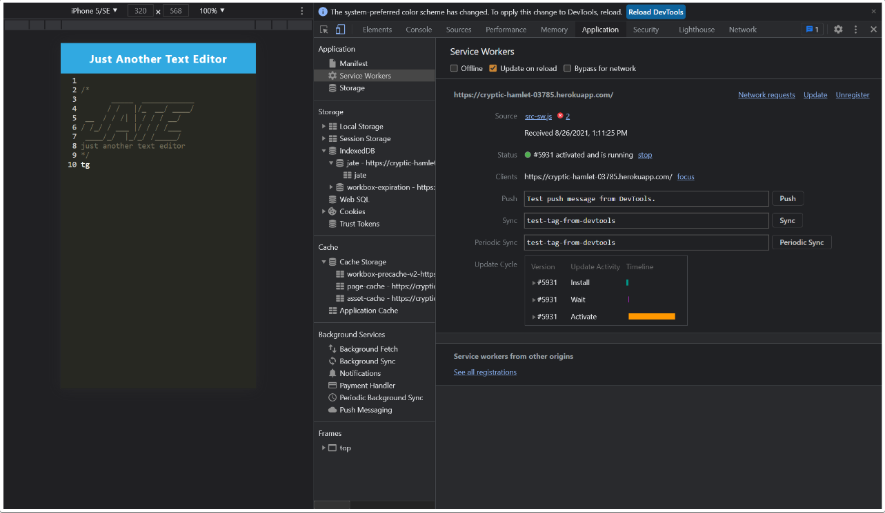
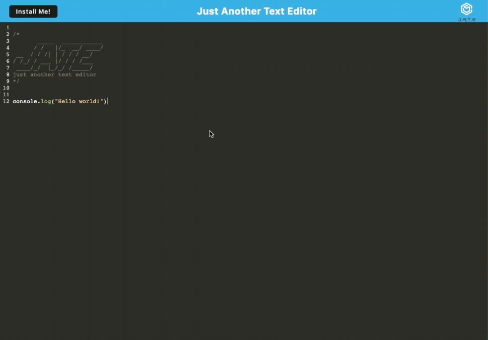

# TextAlterer

[](https://opensource.org/licenses/MIT)

Progressive Web Applications (PWA): Text Editor


## Description

A text editor that runs in the browser. The app will be a single-page application that meets the PWA criteria. It will feature a number of data persistence techniques that serve as redundancy in case one of the options is not supported by the browser. The application will also function offline.


## User Story
```
AS A developer
I WANT to create notes or code snippets with or without an internet connection
SO THAT I can reliably retrieve them for later use
```


## Technologies Used

JSON, JavaScript, CSS, HTML, Express, IndexedDB API, Webpack Plugins, IndexedDB database


## Installation
```
npm install
npm run build
http://localhost:3001 on browser
Then, deploy on Heroku
```

## Visual Demo





## Links

[GitHub Repo](https://github.com/kitkatt17/TextAlterer)

Deployed Heroku Link:  - currently not deploying at the moment -


## License 

[](https://opensource.org/licenses/MIT)

[MIT License](https://opensource.org/license/mit-0/)

For the full text of this license, please click on the link provided.
